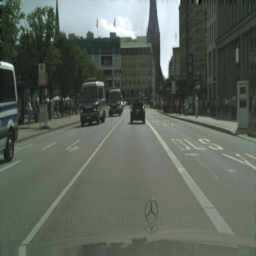
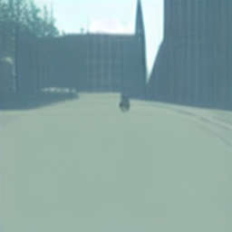
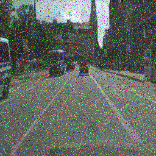

# Latent Diffusion Models
[arXiv](https://arxiv.org/abs/2112.10752) | [BibTeX](#bibtex)


  
## Requirements
A suitable [conda](https://conda.io/) environment named `ldm` can be created
and activated with:

```
conda create --name ldm python=3.9
conda activate ldm
pip install -r requirement.txt
```


## Download the pre-trained weights (5.7GB)
```
mkdir -p models/ldm/text2img-large/
wget -O models/ldm/text2img-large/model.ckpt https://ommer-lab.com/files/latent-diffusion/nitro/txt2img-f8-large/model.ckpt
```
and sample with
```
python scripts/txt2img.py --prompt "a virus monster is playing guitar, oil on canvas" --ddim_eta 0.0 --n_samples 4 --n_iter 4 --scale 5.0  --ddim_steps 50
```
## Semantic Communication with Diffusion Model
The image you want to send should be put on "input_img" directory.
```
rm -r sentimg
```
```
rm -r outputs/txt2img-samples
```
```
python -m scripts.img2img
```

### Sent image


### Latent space
The input image compressed by AutoEncoder.

### Received Image
The image with noise sampling.



The image by LDPC .



## Result


